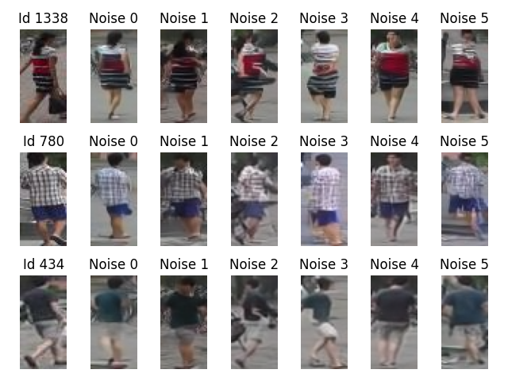
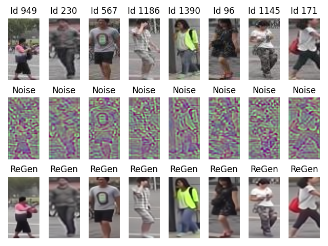

# GenerativePersonReID
**A generative approach to person re-identification**

Person Re-identification is the problem of identifying comparable subjects across a network of nonoverlapping cameras. Typically, this is accomplished by deriving a vector of distinctive features from the source image that represent the specific person captured by the camera. Developing a robust, invariant, and discriminative set of features is a challenging undertaking, often utilizing contrastive learning.

In this work, we explores an alternative approach, where the representation of an individual is learned as the conditioning information needed to generate images of that specific person in different poses and backgounds. By doing so, we untether the identity of the individual from other information related to a specific instance, captured in the noise. This decoupling allows for intriguing explorations of the underlying latent spaces, and interesting transformations from one identity to another. The generative models employed in this research are recent diffusion models, known for their sensitivity to conditioning across various contexts.

-----

The first step consists in training a generative model of persons, conditioned over the identity of the person, as described in the following Figure.

  

On the left, we show three sample identities taken from the Market1501 dataset. Then, we sample 5 random noises, and for each of them we generate an image conditioned by the given identity; the noise in each column is always the same.

Since the distribution of the latent representation of the identities in the latent space is unknown,
we need to learn it, and we use an auxiliary small generative model for this purpose. 

------
The next step consits in inverting the generative model. In this way, starting from an image, we can extract the latent representtion of the person identity and the underlying "noise", captruing, in principle, all inforamtion not related to the specific identity.

  

